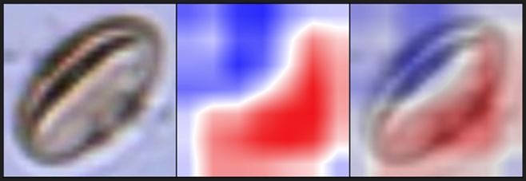

# FastAblationCAM

```
TL;DR

Pre-requisite installs: Python3.9 (64-bit), cuDNN SDK 8.1.0 (for CUDA 11.2), CUDA 11.2
pip install -r requirements.txt

Process when running test_ablation.py (located in /tests/):
1) Load POLEN23E test data and clean it up a little
2) Initialize DenseNet-169 model without weights 
3) Load model pre-trained weights from "./tests/test_model_checkpoints"
4) Iterate through the model and get a new model that outputs the activations of the final convolutional layer alongside the model 
   scores. This is where you can choose which convolutional layer to apply the FastAblationCAM.
5) Initialize FastAblationCAM with the new, iterated model
6) Loop through test images and apply FastAblationCAM

Note that early convolutional layers take forever to ablate and are less likely to produce a good result. 
The last convolutional layer is the default for a reason: it's faster and changing the values has a noticeable 
effect on the model performance, which results in nearly identical heat maps as Grad-CAM (scroll to the end of the page for examples).
```

## Introduction

Saliency mapping is an important part of validating image recognition CNN models. The reason we’re interested in the model’s area of attention is because we have to ascertain that the model classifies images for the right reason.

For instance, [Lapuschkin and colleagues](https://www.nature.com/articles/s41467-019-08987-4) showed that CNNs may use irrelevant features like watermarks to classify pictures as horses, regardless of whether the true class is a car or a horse. 


Saliency maps (excluding Activation Maximization and Concept-based methods) can be divided into perturbation and gradient-based methods:


Of these, [Ablation-CAM](https://openaccess.thecvf.com/content_WACV_2020/papers/Desai_Ablation-CAM_Visual_Explanations_for_Deep_Convolutional_Network_via_Gradient-free_Localization_WACV_2020_paper.pdf) applies perturbation methods to convolutional layers and omits the use of gradients. 

## Ablation-CAM

The way [Ablation-CAM](https://openaccess.thecvf.com/content_WACV_2020/papers/Desai_Ablation-CAM_Visual_Explanations_for_Deep_Convolutional_Network_via_Gradient-free_Localization_WACV_2020_paper.pdf) works is that you first measure a baseline for an image by passing it through the network and measure the class score. 


To create an [Ablation-CAM](https://openaccess.thecvf.com/content_WACV_2020/papers/Desai_Ablation-CAM_Visual_Explanations_for_Deep_Convolutional_Network_via_Gradient-free_Localization_WACV_2020_paper.pdf) heatmap, you again take the same input image and you pass it through the network, but instead of passing the forward activations as normal, you modify the CNN by setting all of the activation values in a single feature map of a convolutional layer to zero. Now, we get a potentially different class score from the model which should in theory be lower than baseline because the model has less information to work with. We then create a weight from the baseline score and the new score for that activation feature map. This process is repeated for each feature map in the stack of feature maps. 


The weighted activation maps are summed and passed through ReLU. The final importance map is upsampled to match the width and height of the input image. 


## Improving Ablation-CAM

We can make this process a little faster by taking some shortcuts. Graphically, each convolutional layer tends to be deeper than it is high or wide, especially in the final convolutional layer. Often the depth of the convolution is actually even larger than the multiplication of the height and width.


As shown below, we can use this information to our advantage by zeroing the feature map stack depthwise rather than on feature map by feature map basis. 


As we do this, we measure the change in class scores ($y^c$ - $y^c_k$) at each location of the depthwise ablation, which creates a two-dimensional importance heat map.


We then only have to normalize the values to [0,1] and scale them to the usual pixel value range of [0 – 255 ] before we upsample the 2D map to match the original image size. 

Note how we do not have to resort to weighting each feature map with the change in class score and there is no summation nor ReLU at the end, which means that the final saliency map is more intuitive because it relates directly to the change in class score. This method is in theory faster than normal Ablation-CAM when the multiplication of width and height is smaller than the number of feature maps. For example, the final convolutional layer in DenseNet-169 has 1664 feature maps while the width and height have seven pixels, which results in a potential 33x speed improvement.

## Results

In testing, I found that the FastAblationCAM does not work for deep internal convolutional layers, at least for DenseNet-169. One possible reason is that the model's performance is entirely unaffected by changing any given single pixel in the activations as the model can compensate through skip connections. This remains to be tested and it's possible that increasing the size of the ablation window from one pixel could change the results. This would also make it much faster for earlier layers because they tend to have larger height and width dimensions and the ablation could take forever. Thus, as long as the ablation window size results in fewer steps than when applying Ablation-CAM on a feature map basis, this method would be faster. Nonetheless, for the last convolutional layer, FastAblationCAM creates heatmaps comparable to Grad-CAM:

Grad-CAM: 





FastAblationCAM:


Interestingly, there appears to be a lateral shift in the location of the activated areas between the two methods. I do not have an explanation for this phenomena and I could not find an issue with the code.
